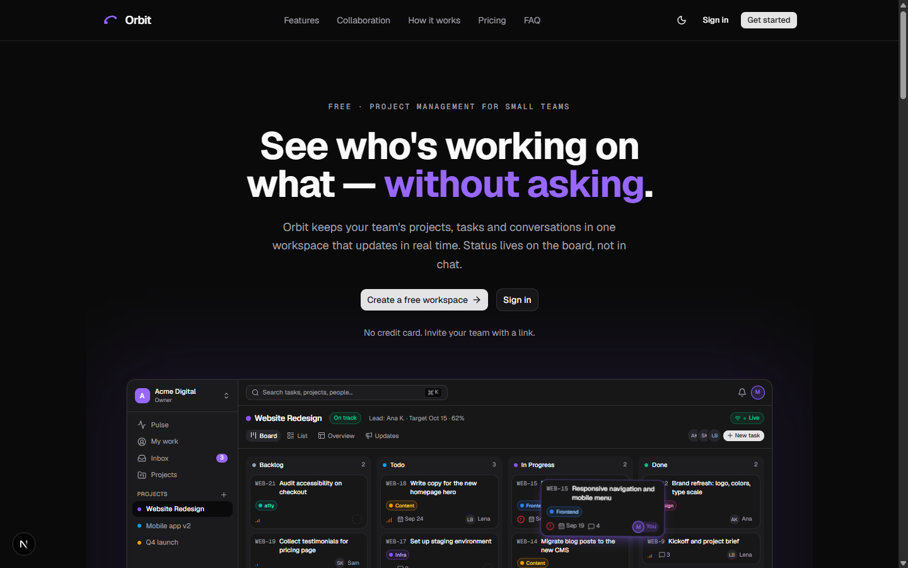

<div align="center">

# Orbit

**Real-time collaborative project management for small teams.**

[**Live Demo**](https://orbit-ten-cyan.vercel.app) · [**Repository**](https://github.com/musab-abukaraki-66/orbit) · Built by [Musab AbuKaraki](https://github.com/musab-abukaraki-66)

[Architecture](docs/architecture.md) · [Database](docs/database.md) · [Engineering Challenges](docs/engineering-challenges.md) · [Interview Story](docs/interview-story.md)

     

</div>

<br />

<p align="center">
  
</p>

<br />

## Why Orbit?

Small teams rarely lose time because people aren't working. They lose time because the current state of the work is hard to see. A task's status lives in someone's head, or a Slack thread, or a spreadsheet that went stale the moment someone updated it somewhere else — so people end up asking each other "where are you with this?" instead of just looking.

Orbit centralizes that into one workspace: projects hold work items, work items carry a status, priority, assignee and due date, and every change is visible to the whole team the moment it happens — no refresh, no "let me check and get back to you."

## The idea

Give a team one shared, realtime picture of their work instead of a dozen partial ones. A project is a body of work with a lead, a status and a health signal. A work item is one piece of that work, with comments and a full activity history attached. Everything that happens gets logged and fanned out as a notification to the people who need to see it.

## How it works

```text
Workspace
  → Projects
      → Work Items (status · priority · assignee · due date · labels)
          → Comments & Activity
  → Notifications
  → Realtime — every connected client sees the current state, live
```

## Can I try it myself?

Yes. The [live demo](https://orbit-ten-cyan.vercel.app) is the real, deployed app — sign up, create a workspace, and you get a short sample project to click around in. No credit card, no email service required to invite a teammate (see [Live Demo](#live-demo) below for exactly how that works).

<br />

## Product tour

A guided walk through the actual product, screen by screen.

### Pulse

The answer to "what's going on?" without asking anyone: overdue work, recent activity, and who's carrying what across the whole workspace.

### Projects and the Kanban board

A project is a body of work with a lead, a status, a health signal (on track / at risk / off track) and a target date. Board, list, overview and updates are different views over the same underlying work items. Drag a card between columns and it moves for everyone watching, immediately — columns are your workspace's statuses, editable in Settings.

### Work items, comments and activity

Title, description, status, priority, assignee (must be a workspace member — enforced in Postgres, not just the UI), due date, labels. Deep-linkable with `?item=KEY` so a card can be shared directly. `@mention` a teammate in a comment to notify them; every status change, reassignment, priority change and edit is written to an append-only activity log attached to the item, so context never has to be reconstructed from memory.

### My Work

The same work-item model, filtered to what's assigned to you — the personal lens on top of the shared board.

### Inbox

Notifications for assignments, `@mentions`, comments, status changes, invitations and new members, fanned out automatically from the activity log.

### Members and invitations

An admin creates an invite and gets a shareable link immediately; no email service required. The invitee opens it, signs up (or in) with the invited email, and joins automatically. If `RESEND_API_KEY` is configured, the same link is also emailed.

### Settings

Workspace name and slug, members and roles, statuses, labels, notification preferences — the structural knobs an admin needs, scoped to what their role is actually allowed to touch.

### Realtime

Every board, list, task sheet, label set, member list, inbox and Pulse page stays in sync across every connected browser — no refresh. See [Realtime Collaboration](#realtime-collaboration) below for the end-to-end mechanism.

<br />

## Core product model

```text
Workspace  (tenant boundary — slug, key, roles: owner / admin / member)
  ├── Members (workspace_memberships)
  ├── Teams → Statuses            (one hidden default team owns the Kanban columns)
  ├── Labels
  ├── Invitations
  └── Projects
        ├── Project members, updates, health
        └── Work Items
               ├── Comments (@mentions)
               ├── Labels
               └── Activity Log ──► Notifications
```

Verified against the current schema — see [docs/database.md](docs/database.md) for every table, trigger, RPC and RLS policy.

<br />

## Engineering highlights

| Area | What problem existed | What I implemented | Why it matters |
|---|---|---|---|
| **Authentication** | Need real accounts without owning password storage or session security myself | Supabase Auth (email/password, password reset via recovery links), a Next.js 16 `proxy.ts` route guard on top | No credential handling code to get wrong; the guard keeps unauthenticated requests from ever reaching a page that assumes a user |
| **Workspace isolation** | Multiple teams' data must never cross | Every table carries a `workspace_id`; every RLS policy checks membership through it | A query that "forgot" a `WHERE workspace_id = …` still can't leak another tenant's rows — Postgres refuses it |
| **Role-based authorization** | Owner/admin/member need genuinely different capabilities, not just hidden buttons | Role rank enforced in Postgres (`private.rank`) — in RLS policies and in the `create_invitation` / `transfer_ownership` RPCs | An admin can't invite themselves an owner account by calling the API directly; the UI hiding a button was never the actual protection |
| **Data integrity** | An assignee, a status, a label must belong to the same workspace/team as the row referencing them | Composite foreign keys (`(status_id, team_id)`) and a `SECURITY DEFINER` trigger that rejects assigning a non-member | Impossible states (a task "assigned" to someone outside the workspace) can't exist in the data, not just "shouldn't happen" |
| **Realtime collaboration** | Boards, inbox and Pulse need to reflect what's true right now, for everyone watching | Supabase Realtime (`postgres_changes`) on 8 tables, version-reconciled optimistic UI, resync on reconnect/visibility | The product's actual value proposition — see [below](#realtime-collaboration) |
| **Invitations without email dependency** | Free small-team tool can't require paid email infrastructure to function | Token-hashed, expiring, shareable invite links; Resend is optional and additive | Onboarding a teammate never blocks on email deliverability |
| **Notifications** | Users need to know what's relevant without polling | A trigger fans out `activity_log` rows into per-user `notifications` at write time | No polling, no missed events, no separate notification service |
| **Activity history** | "What happened to this task?" shouldn't require memory or Slack archaeology | An append-only `activity_log`, writable only by triggers (`authenticated` has no direct insert/update/delete grant) | The audit trail can't be edited or backdated by a client, intentionally or by a bug |
| **Automated testing** | Realtime, permissions and multi-user flows are exactly the kind of bug that's invisible in a single-browser manual test | 8 Playwright suites, including a two-independent-browser-context realtime journey | Caught real bugs before users would have (see [Engineering Challenges](docs/engineering-challenges.md)) |
| **Production deployment** | Ship something a stranger can actually open and use | Vercel + CI (lint/typecheck/build on every push), verified bundle isolation for the landing page's animation chunk | The live demo is the actual deployed artifact, not a curated local build |

<br />

## Realtime collaboration

```text
User A moves a card on the board
        ↓
Server Action writes the change to Postgres
        ↓
A trigger bumps the row's version and appends to activity_log
        ↓
Supabase Realtime emits a postgres_changes event for that row
        ↓
Every subscribed client (User B, User C, …) receives the event
        ↓
Their UI merges it by version and re-renders — no refresh
```

In plain terms: nobody is polling, and nobody has to hit refresh to trust what's on screen. If you're looking at a board and a teammate moves, renames, or relabels a card, you see it change.

Mechanically, `components/items/board.tsx` subscribes to `postgres_changes` on `work_items`, `work_item_labels` and `comments`, scoped by RLS to rows the subscriber can actually see. `lib/supabase/realtime.ts` pushes the caller's session token to the socket before every subscribe — Realtime evaluates row filters against that token, and an early or missing token means the channel silently receives nothing (this is exactly the bug documented in [Engineering Challenges](docs/engineering-challenges.md#realtime-channel-joined-with-the-wrong-credentials)). `work_items` and `projects` carry a `version` column bumped on every update, so a client reconciling a live event against its own optimistic state always keeps whichever version is actually newer. Views that read via Server Components instead of holding live rows client-side (Pulse, lists, inbox) use a debounced `router.refresh()` (`components/realtime/use-live-refresh.ts`) triggered by the same events, and everything resyncs on reconnect and when a backgrounded tab becomes visible again.

<br />

## Security & data isolation

**The frontend is not the security boundary. Access is enforced at the database layer.**

Every one of Orbit's 15 tables has Row Level Security enabled, and `anon` has zero table grants — an unauthenticated request cannot read a single row, regardless of what the client sends. There is no service-role key anywhere in the app or in Vercel's environment; every query, from every Server Component and every Server Action, runs as the signed-in user's own session through the same anon key and RLS the browser would use.

- **Supabase Auth** issues and manages sessions; Orbit never stores a password.
- **Workspace isolation** — every table carries a `workspace_id`, and RLS policies check membership through `private.is_ws_member()` / `private.is_ws_admin()`, both `SECURITY DEFINER` functions with `search_path = ''` locked against search-path hijacking.
- **Role enforcement** — owner/admin/member rank is compared in Postgres itself, not just hidden in the UI: an admin cannot invite or promote someone to a role at or above their own.
- **Assignment constraints** — a trigger rejects assigning a work item to anyone who isn't currently a member of that workspace; the UI only offering members as options is a convenience, not the guarantee.
- **Invitation token handling** — invitation tokens are never stored; only their SHA-256 hash is. The one RPC callable by `anon` (`get_invitation`) returns a masked email so an invite link can render before sign-in without leaking who was invited.
- **Data integrity** — last-owner protection (a workspace can't be left without an owner), immutable membership identity columns, and a trigger that clears (never destroys) a work item's assignee when that member is removed — see [Engineering Challenges](docs/engineering-challenges.md#membership-removal-and-dangling-assignments).

Full policy-by-policy detail: [docs/database.md](docs/database.md#row-level-security).

<br />

## Testing & validation

Verified locally against the current `main` branch on 2026-09-22:

| Check | Result |
|---|---|
| `npm run lint` (ESLint) | ✅ clean |
| `npm run typecheck` (`next typegen` + `tsc --noEmit`) | ✅ clean |
| `npm run build` (production build + bundle-isolation check) | ✅ succeeds, 29 routes, GSAP chunk correctly isolated to `/` |
| Playwright e2e suites | 8 spec files, 57 test cases — see below |

`.github/workflows/ci.yml` runs lint, typecheck and build on every push and pull request against `main`, with placeholder Supabase credentials (no live database needed for CI to catch a broken build).

The Playwright suites need a running dev server and a real Supabase project (`E2E_*` vars in `.env.local`), so they run locally rather than in CI:

- **`v2-journey.spec.ts`** (17 cases) — sign-up, onboarding, projects, tasks, drag & drop, comments, settings, invitations, a second browser context joining via link, cross-browser realtime, notifications, mobile overflow, 404, sign-out.
- **`realtime-two-browsers.spec.ts`** (17 cases) — two independent browser contexts (owner + invited member) through create/assign/move/edit/label/comment/delete, offline-reconnect, reload, workspace isolation on the realtime socket, cleanup.
- **`auth-and-routing.spec.ts`** (14 cases) — sign-up validation, sign-in errors, session persistence, sign-out, route guards, 404s, the auth callback.
- **`password-recovery.spec.ts`** (4 cases) — the reset-password flow, without a mailbox.
- **`console-audit.spec.ts`** (2 cases) — fails on any browser console error across the main routes.
- **`membership-assignee-cleanup.spec.ts`** (1 case) — removing a member clears their assignee pointer on open work items and preserves everything else.
- **`item-save-error-handling.spec.ts`** (1 case) — a simulated failed save reverts the UI to a consistent state instead of hanging.
- **`send-real-invite.spec.ts`** (1 case, skipped by default) — sends one real invitation email through Resend; only runs when `INVITE_TO` is set, since it needs a live inbox to check.

<br />

## Live demo

**[orbit-ten-cyan.vercel.app](https://orbit-ten-cyan.vercel.app)** is the actual production deployment — Next.js on Vercel, Supabase for Postgres/Auth/Realtime.

- **Invitations work today with zero configuration** — every invite is a shareable link, independent of email.
- **Email delivery is a separate, optional layer.** If a `RESEND_API_KEY` is configured, invitation links are *also* emailed through Resend's free tier. Without it, Orbit still fully works — the link is just shown in the UI to copy and share. Don't confuse "the invitation system works" with "email is fully operational" — they're independently true or false.
- **AI and Billing are UI previews.** Both pages are visible, clearly labeled "Coming soon," and functional as far as their UI goes — but there's no AI API and no Stripe wired up behind them. See [Current Limitations](#current-limitations--next-steps).

<br />

## Current limitations & next steps

- **AI assistant is a UI preview, not connected to an AI backend.** The `/w/[slug]/ai` page shows the intended interface and interactions; there's no LLM call behind it yet.
- **Billing is a UI preview; Stripe is not implemented.** The billing page shows a Free/Pro plan comparison; there's no payment processing, and the whole app is free to use.
- **Resend email delivery requires configuration.** Without `RESEND_API_KEY`, invitations still work fully via link; with it, links are also emailed (subject to Resend's free-tier sending restrictions until a domain is verified).
- **Single default team per workspace.** The schema supports multiple teams per workspace, but the product only creates and surfaces one today.
- **No mobile app.** The web app is responsive, but there's no native client.

These are the honest next steps for the product, not a hidden list of things that don't work.

<br />

## Quick start

```bash
git clone https://github.com/musab-abukaraki-66/orbit.git
cd orbit
npm install
cp .env.local.example .env.local   # then fill in the Supabase values
npm run dev
```

Open <http://localhost:3000>.

### Supabase

1. Create a Supabase project and apply `supabase/migrations/20260916200000_v2_schema.sql` (SQL editor, `supabase db push`, or the Supabase MCP `apply_migration`).
2. In **Authentication → Providers → Email**, turn **Confirm email** off (Orbit signs users in immediately after sign-up), or keep it on if you prefer confirmation emails.
3. Copy the project URL and anon key into `.env.local`.

| Variable | Where used |
|---|---|
| `NEXT_PUBLIC_SUPABASE_URL` | browser + server |
| `NEXT_PUBLIC_SUPABASE_ANON_KEY` | browser + server (safe to expose; RLS protects data) |
| `NEXT_PUBLIC_SITE_URL` | server: absolute origin for auth redirects, invite links, emails and OG metadata |
| `RESEND_API_KEY` / `RESEND_FROM_EMAIL` | server, optional (Resend free tier); emails the invitation link in addition to showing it |

The Supabase service-role key is never used and must not be added to the app or to Vercel. Full setup detail, including password reset and email configuration, stays in this README's git history and in [`CLAUDE.md`](CLAUDE.md) for anyone extending the project.

### Scripts

| Command | What it does |
|---|---|
| `npm run dev` | dev server |
| `npm run build` / `npm start` | production build (also verifies bundle isolation) |
| `npm run lint` | ESLint |
| `npm run typecheck` | `next typegen` + `tsc --noEmit` |
| `npm run test:e2e` | Playwright suites (needs `E2E_*` vars in `.env.local` and a running dev server) |

### Deploying to Vercel

1. Import the GitHub repository into Vercel (framework preset: Next.js).
2. Add the environment variables above. Do **not** add the service-role key.
3. In Supabase **Authentication → URL Configuration**, set the Site URL to your Vercel domain and add it to the redirect allow-list.
4. Deploy. CI (`.github/workflows/ci.yml`) runs lint, typecheck and build on every push.

<br />

## Project layout

```text
app/(auth)          login, signup, forgot-password, update-password, onboarding
app/auth/callback   Supabase Auth email-link landing (recovery)
app/invite          invitation landing + accept
app/(app)/w/[slug]  workspace: pulse, my-work, inbox, projects, items, search, ai, profile, settings/*
components/         ui primitives, items (board/list/detail), projects, members, inbox, settings, realtime
lib/                auth, workspaces, members, projects, items, statuses, notifications, search, supabase
supabase/migrations/20260916200000_v2_schema.sql   full schema, triggers, RPCs, RLS, realtime publication
e2e/                Playwright suites
docs/               architecture, database, product decisions, engineering challenges, interview story
```

<br />

## What I built

I designed and built Orbit end-to-end — the product model, the Postgres schema and its RLS policies, the realtime sync, the Next.js application, and the Playwright test suites. Where I used AI pair-programming tools during development, the engineering decisions, tradeoffs and fixes documented in [docs/product-decisions.md](docs/product-decisions.md) and [docs/engineering-challenges.md](docs/engineering-challenges.md) are mine.

<br />

<div align="center">

Built by [Musab AbuKaraki](https://github.com/musab-abukaraki-66) · [Live Demo](https://orbit-ten-cyan.vercel.app) · [Repository](https://github.com/musab-abukaraki-66/orbit)

</div>
